# VShop - E-commerce Microservices Architecture

  

## 🛒 Sobre o Projeto

O **VShop** é uma aplicação de E-commerce robusta desenvolvida para demonstrar competências avançadas em desenvolvimento C# e arquitetura de software. O projeto foi construído utilizando uma arquitetura de **Microsserviços**, garantindo escalabilidade, desacoplamento e facilidade de manutenção.

O objetivo principal deste projeto é simular um ambiente real de vendas online, abrangendo desde a autenticação segura de usuários até o gerenciamento de catálogo, carrinho de compras e aplicação de cupons de desconto.

### 🏗️ Arquitetura e Padrões

A solução foi estruturada seguindo as melhores práticas de mercado:

- **Microservices Architecture:** A aplicação é dividida em serviços autônomos (Product, Cart, Discount, Identity).
- **MVC (Model-View-Controller):** Utilizado no Front-end (`VShop.Web`) para renderização das páginas.
- **API RESTful:** Comunicação entre o Front-end e os serviços de Back-end.
- **Repository Pattern:** Abstração da camada de acesso a dados.
- **DTOs (Data Transfer Objects):** Para transporte eficiente de dados entre processos e desacoplamento das entidades de domínio.
- **Entity Framework Core (Code First):** Mapeamento Objeto-Relacional e gerenciamento de banco de dados.
- **Autenticação Centralizada:** Implementada com **Duende IdentityServer**, utilizando OpenID Connect e OAuth2.

---

## 🚀 Tecnologias Utilizadas

O projeto foi desenvolvido com uma stack moderna:

- **Linguagem:** C#
- **Plataforma:** .NET 10 (ASP.NET Core Web API & MVC)
- **Banco de Dados:** PostgreSql (via Entity Framework Core)
- **Autenticação:** Duende IdentityServer
- **Front-end:** Razor Views, Bootstrap 5, Javascript
- **Ferramentas:** Rider IDE, Scalar Open API (para documentação de API)

---

## 📷 Screenshots

### Página Inicial (Catálogo)

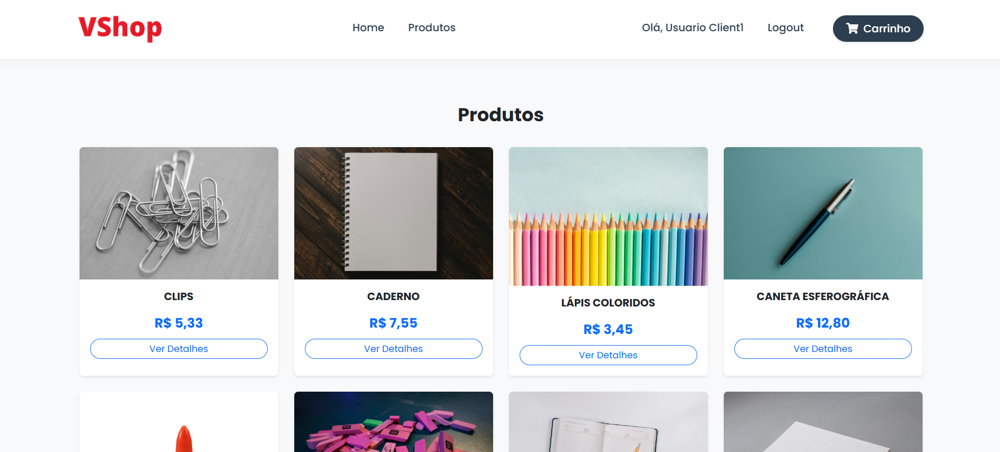
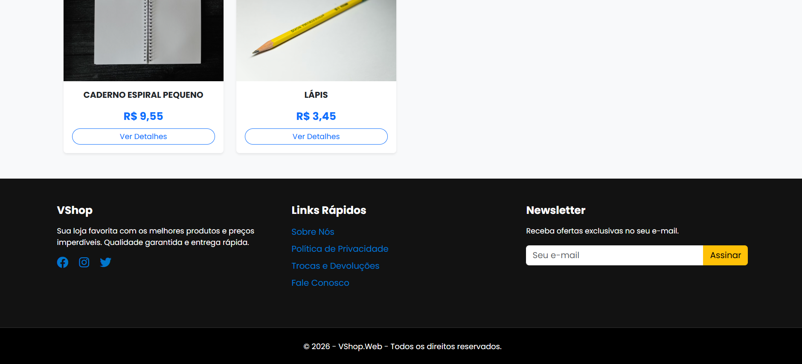
_Visualização dos produtos disponíveis com integração ao microsserviço de Produtos._

### Detalhes do Produto

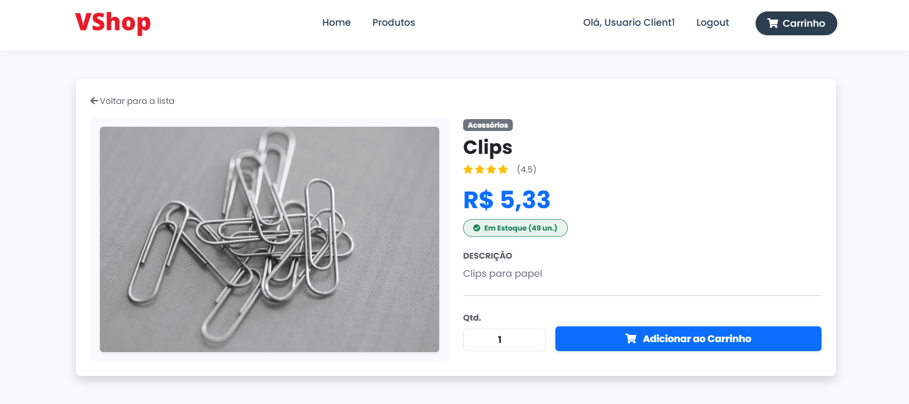
_Página de detalhes permitindo adicionar itens ao carrinho._

### Carrinho de Compras e Checkout

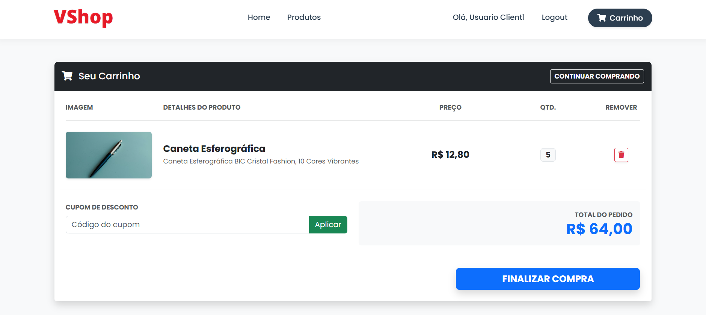
_Gerenciamento de itens, aplicação de cupons de desconto e finalização de compra._

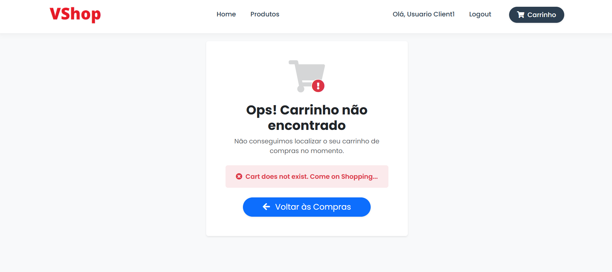

### Finalização da Compra

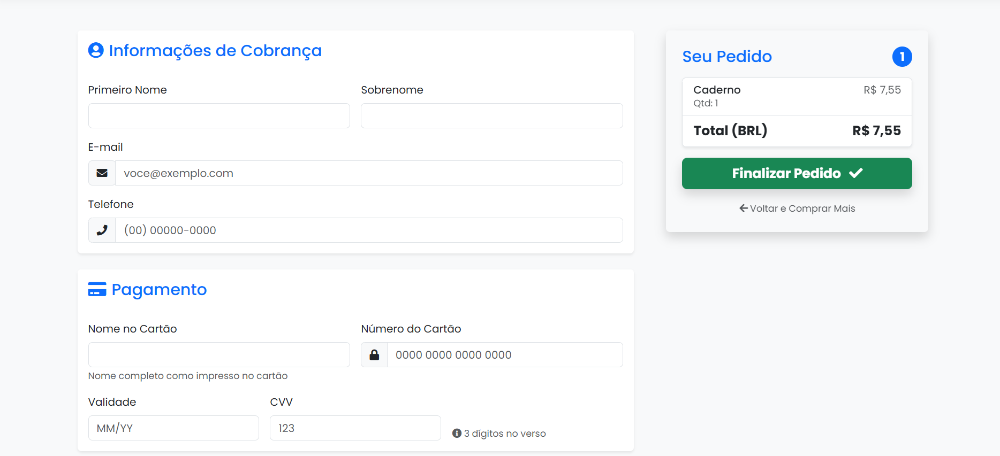

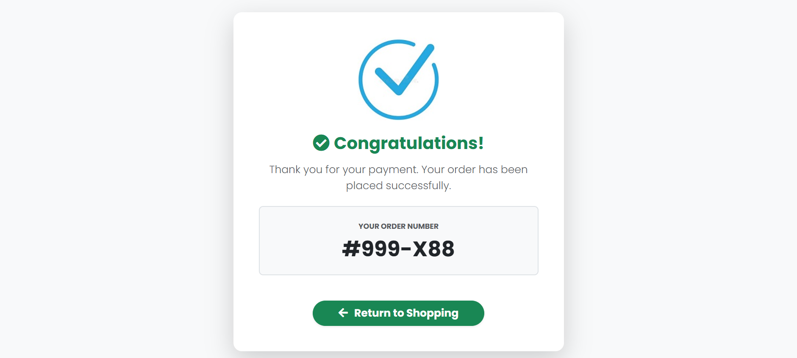
_Mensagem de confirmação da compra que foi realizada_

### Dashboard do Administrador

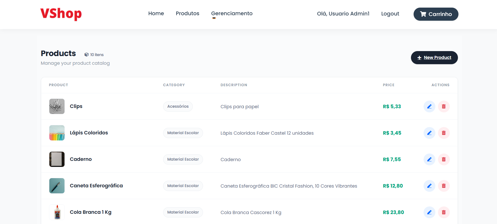
_Operações básicas de gerenciamento_

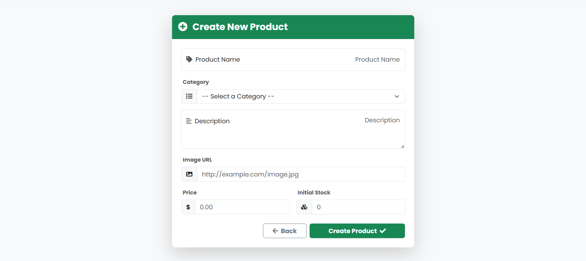
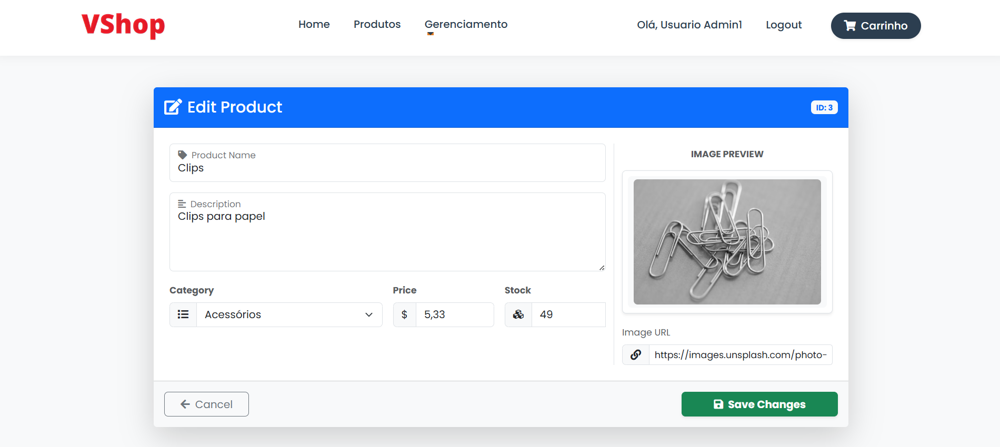
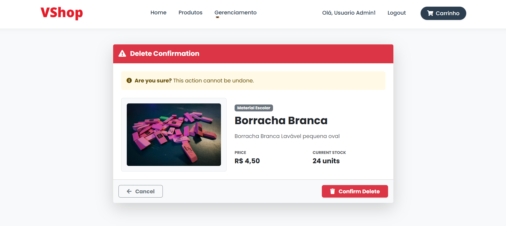


_(Nota: Imagens ilustrativas do projeto)_

---

## ⚙️ Estrutura dos Microsserviços

A solução é composta pelos seguintes projetos principais:

1.  **VShop.IdentityServer:** Responsável pela segurança, emissão de tokens JWT e validação de usuários (Admin/Client).
2.  **VShop.ProductApi:** Gerencia o catálogo de produtos e categorias. Permite CRUD completo.
3.  **VShop.CartApi:** Gerencia o carrinho de compras do usuário (adicionar, remover, limpar carrinho).
4.  **VShop.DiscountApi:** Gerencia cupons de desconto que podem ser aplicados no carrinho.
5.  **VShop.Web:** Aplicação cliente MVC que consome todos os microsserviços acima e apresenta a interface ao usuário.

---

## 🔧 Pré-requisitos

Antes de começar, certifique-se de ter instalado em sua máquina:

- [.NET SDK](https://dotnet.microsoft.com/download) (Versão compatível com o projeto, ex: .NET 8 ou superior)
- [PostgreSQL](https://www.postgresql.org/download/) Versão mais recente
- [Visual Studio 2022](https://visualstudio.microsoft.com/) (Recomendado) ou VS Code/Rider IDE.

---

## 📥 Instalação e Configuração

Siga o passo a passo abaixo para rodar a aplicação em seu ambiente local.

### 1. Clone o Repositório

```bash
git clone https://github.com/vmlof/VShop.git
cd VShop
```

## 2. Configuração do Banco de Dados

O projeto utiliza o **Entity Framework Core**. É necessário aplicar as Migrations para criar os bancos de dados de cada microsserviço.

Abra o Console do Gerenciador de Pacotes (Package Manager Console) no Visual Studio ou utilize o terminal, e execute os comandos para cada projeto:

**VShop.IdentityServer:**

```PowerShell
Update-Database -Project VShop.IdentityServer
```

```PowerShell
Update-Database -Project VShop.ProductApi
```

**VShop.CartApi:**

```PowerShell
Update-Database -Project VShop.CartApi
```

**VShop.DiscountApi:**

```PowerShell
Update-Database -Project VShop.DiscountApi
```

**Nota:** Isso criará as tabelas e inserirá os dados iniciais (Seed) de usuários, produtos e descontos automaticamente, conforme configurado nas classes de `SeedDatabase`.

## 3. Configuração de Inicialização (Startup)

Como se trata de uma arquitetura de microsserviços, **todos os projetos devem ser executados simultaneamente**.

No Visual Studio:

1. Clique com o botão direito na **Solução (Solution 'VShop')**.

2. Selecione **"Definir Projetos de Inicialização" (Set Startup Projects)**.

3. Escolha **"Vários projetos de inicialização" (Multiple startup projects)**.

4. Defina a ação como **"Iniciar" (Start)** para os seguintes projetos:

   - VShop.IdentityServer

   - VShop.ProductApi

   - VShop.CartApi

   - VShop.DiscountApi

   - VShop.Web

---

## ▶️ Como Testar

Após iniciar a solução, as aplicações subirão nas portas configuradas (HTTPS). O navegador padrão deve abrir a aplicação Web, mas você pode navegar manualmente:

- Aplicação Web (Loja): https://localhost:7087

- Identity Server: https://localhost:7275

- Product API (Scalar): https://localhost:7058

- Cart API (Scalar): https://localhost:7284

- Discount API (Scalar): https://localhost:7086

### 🔐 Credenciais de Acesso

O banco de dados é populado automaticamente com dois usuários de teste (definidos em `DatabaseIdentityServerInitializer.cs`):

| Perfil        | login   | Senha         | Permissões                                   |
| ------------- | ------- |---------------| -------------------------------------------- |
| Administrador | admin1  | `Admin#2026`  | Acesso total (Criar/Editar/Excluir Produtos) |
| Cliente       | client1 | `Client#2026` | Comprar, Visualizar, Adicionar ao Carrinho   |

---

## 🧪 Fluxo de Teste Sugerido

1. Acesse a **Web App**.

2. Faça **Login** utilizando o usuário **Cliente**.

3. Navegue pelos produtos e adicione itens ao carrinho.

4. No carrinho, tente aplicar um cupom de desconto (`VSHOP_PROMO_1O` e `VSHOP_PROMO_20`)

5. Realize o Checkout.

6. Faça **Logout** e entre como **Administrador**.

7. Tente acessar a área de gerenciamento de produtos para adicionar um novo item ao catálogo.

---
